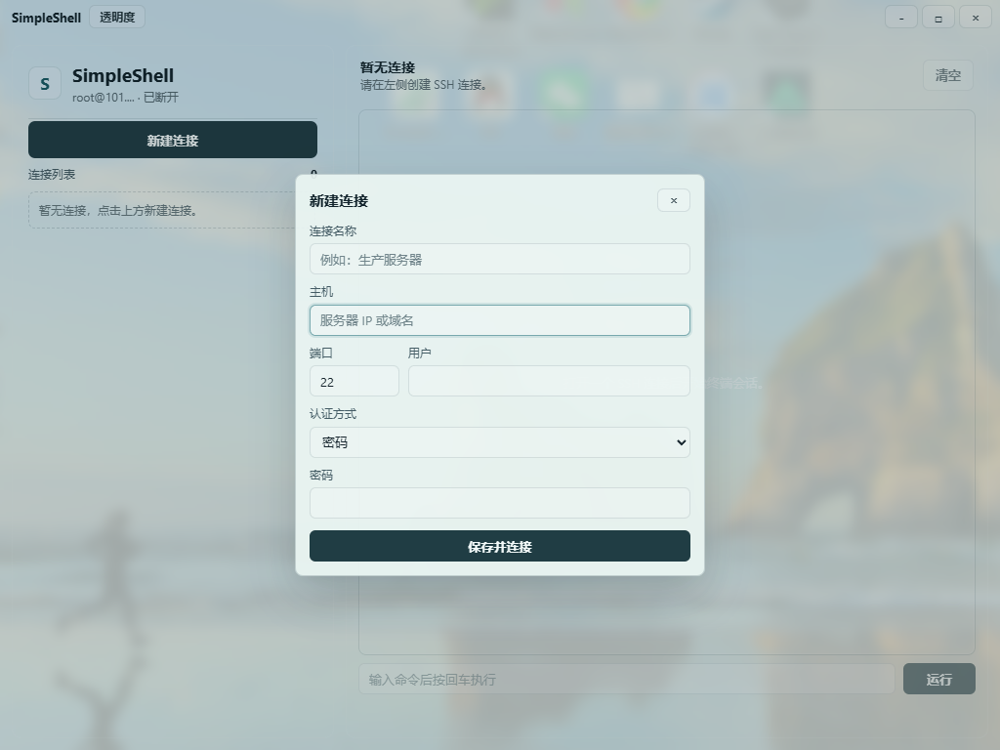
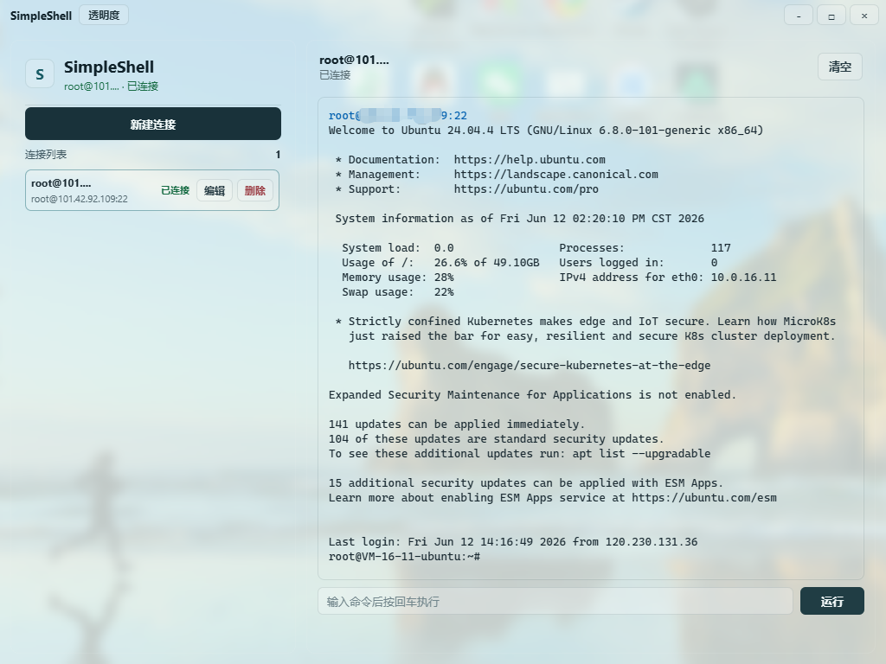

# SimpleShell

SimpleShell 是一个基于 Go 和 Wails 的 Windows SSH 客户端。前端使用 Vanilla TypeScript 和 xterm.js，后端使用 `golang.org/x/crypto/ssh` 处理 SSH 连接。

## 功能

- 支持密码登录和私钥登录
- 支持多个 SSH 连接配置
- 支持连接的新建、编辑和删除
- 支持终端输入、输出、清屏和窗口尺寸同步
- 支持透明背景和背景透明度调节
- 支持主机密钥确认与变更拦截
- 连接信息、密码和私钥口令可以保存到本地，方便下次直接连接

## 操作指引

### 1. 查看连接列表

打开应用后，左侧会显示连接列表。

- 点击顶部的“新建连接”可以新增 SSH 连接。
- 已保存的连接会显示在连接列表中。
- 连接名称过长时，只显示前 9 个字符，后面用 `...` 省略。
- 每个连接右侧提供“编辑”和“删除”按钮。

### 2. 新建连接

点击“新建连接”后，会弹出新建连接窗口。



需要填写：

- 连接名称
- 主机地址或域名
- 端口，默认是 `22`
- 用户名
- 认证方式，支持密码和私钥
- 密码或私钥信息

填写完成后，点击“保存并连接”即可保存配置并发起 SSH 连接。

### 3. 连接成功后使用终端

连接成功后，右侧终端区域会显示服务器输出。



可以进行以下操作：

- 在底部输入框输入命令并回车执行
- 点击“运行”执行输入框中的命令
- 点击“清空”清空当前终端显示
- 点击左侧连接列表中的其他连接切换会话

### 4. 调节透明度

点击窗口左上角的“透明度”按钮，可以调节应用背景透明度。

- `100%` 表示背景完全透明
- 数值越低，背景遮罩越明显

## 技术栈

- Go
- Wails
- WebView2
- TypeScript
- xterm.js

## 开发运行

确保已安装 Go、Node.js、npm 和 Wails CLI。

```powershell
wails dev
```

## 构建

```powershell
wails build -ldflags "-s -w"
```

构建后的 Windows 可执行文件位于：

```powershell
build\bin\SimpleShell.exe
```

## 测试

运行后端测试：

```powershell
go test ./...
```

前端构建验证：

```powershell
cd frontend
npm run build
```

## 配置说明

连接配置会保存在浏览器本地存储中，包含连接名称、主机、端口、用户名、认证方式、SSH 密码、私钥路径和私钥 passphrase。

注意：当前版本保存的密码用于本机便捷连接，不等同于系统级加密凭据管理。请只在可信电脑上使用保存密码功能。

## 目标平台

当前主要面向 Windows x64。

[LINUX DO - 新的理想型社区](https://linux.do/)
